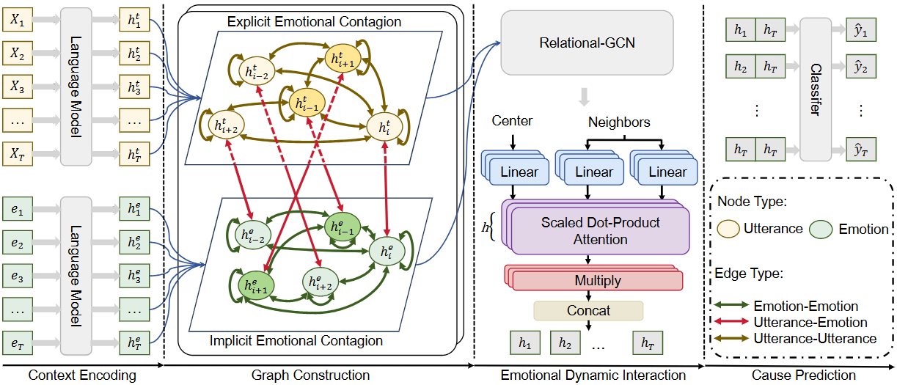

# Beyond Verbal Cues: Emotional Contagion Graph Network for Causal Emotion Entailment

In this paper, we introduce the Emotional Contagion Graph Network (ECGN), a novel model designed to improve causal emotion entailment in conversations by simulating both explicit (verbal) and implicit (non-verbal) emotional influences. 

More details can be found in our paper:
Fangxu Yu, Junjie Guo, Zhen Wu, Xinyu Dai, "[Beyond Verbal Cues: Emotional Contagion Graph Network for Causal Emotion Entailment](https://aclanthology.org/2025.findings-acl.88/)" 

## ECGN



As illustrated in the above diagram, our ECGN framework includes four steps: 
1. **Context Encoding**: Use pretrained language models to extract both the utterance and emotions to obtain the encodings of them.
2. **Graph Construction**: Construct a heterogeneous graph modeling the complex interaction relations, including the simulated implicit and explicit emotional contagion.
3. **Emotional Dynamic Interaction**: Build up a graph-learning model for learning dynamics between different node features.
4. **Cause Prediction**: Use a cause prediction module to identify the causes of emotions within the conversation.

## Code
**1) Download this GitHub**
```
git clone https://github.com/Yu-Fangxu/ECGN.git
```

**3) Run Command for ECGN**
```
bash run.sh 
```
## Citation
```
@inproceedings{yu2025beyond,
  title={Beyond Verbal Cues: Emotional Contagion Graph Network for Causal Emotion Entailment},
  author={Yu, Fangxu and Guo, Junjie and Wu, Zhen and Dai, Xinyu},
  booktitle={Findings of the Association for Computational Linguistics: ACL 2025},
  pages={1755--1767},
  year={2025}
}
```
